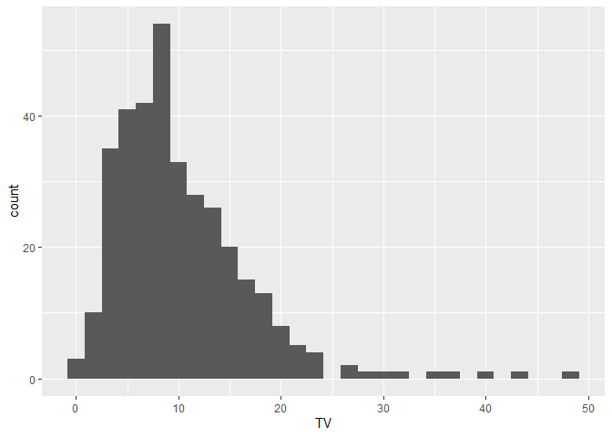
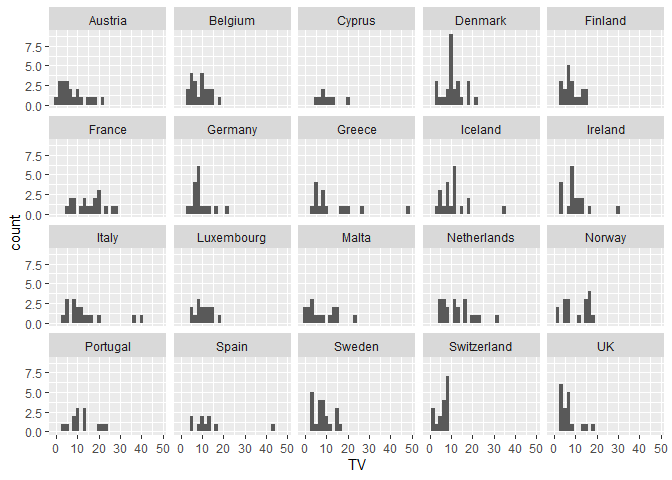
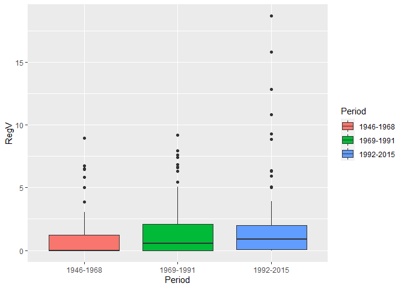
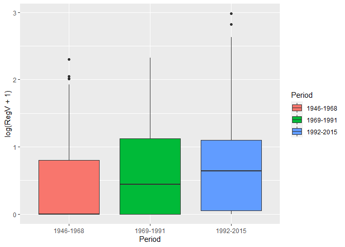
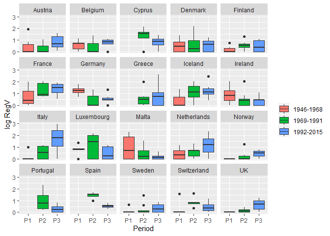

Changing party-systems? Replication exercise on electoral volatility
================
Álvaro Canalejo-Molero
/ March 2022

------------------------------------------------------------------------

First, we have to **set up our project**. In the first chunk of code we
define *knitr* parameters, install and load the necessary packages.

``` r
# Setting the compiling options
knitr::opts_chunk$set(echo = TRUE)

# Cleaning the environment
#rm(list = ls())

# Installing packages
#install.packages("kableExtra")
#install.packages("tidyverse")
#install.packages("readxl")

# Loading packages
library(knitr) # for compiling the document in pdf
library(kableExtra) # for LaTeX based tables
library(tidyverse) # load the tidyverse programming environment
library(readxl) # for importing xlsx files
```

Second, we must **get the data**. We will download it directly from the
internet through R. We start by defining the URL where the data is
hosted.

The dataset **Party system volatility, regeneration and
de-institutionalization in Western Europe (1945–2015)** (Emanuele, 2015)
is on a dedicated webpage from the University Luiss Guido Carli. I have
copied and pasted the URL already.

By default, any RMarkdown document sets the working directory on the
same folder where you have downloaded the .Rmd file. We will get this
path and add the name of the file that contains the data to it.
Therefore, you must substitute the path in *dest* by the path of your
working directory and leave the same file name at the end of the path.

Finally, we can proceed to download the data.

``` r
# Defining the data URL 
data_url <- "https://cise.luiss.it/cise/wp-content/uploads/downloads/2019/03/Dataset-of-Electoral-Volatility-and-its-internal-components-in-Western-Europe-1945-2015.xlsx"

# Get working directory path
getwd()
```

    ## [1] "C:/Users/acana/Dropbox/Research/GitHub/teaching/cwps_continuity_and_change_unilu2022/07_session"

``` r
# Create the destine file in your working directory
## in my case
dest <- "C:/Users/acana/Dropbox/Research/GitHub/teaching/cwps_continuity_and_change_unilu2022/07_session/volatility_data.xlsx"

# Download the data to the working directory
download.file(data_url, dest, mode="wb")
```

The next step is **opening the data** contained in the .xlsx file.

``` r
# Open the data
vol_data <- read_excel("C:/Users/acana/Dropbox/Research/GitHub/teaching/cwps_continuity_and_change_unilu2022/07_session/volatility_data.xlsx")
```

Check at the environment tab below. Can you find the volatility_data
object there? Great! That means that we have the data already!

Now, the show must go on. **The first thing to do whenever we analyse a
new dataset is taking a first look at its structure**. We will use the
tidyverse environment instead of R base functions for the most of it.

``` r
# Look at the data structure
glimpse(vol_data)
```

    ## Rows: 347
    ## Columns: 8
    ## $ Country       <chr> "Austria", "Austria", "Austria", "Austria", "Austria", "~
    ## $ Election_Year <dbl> 1949, 1953, 1956, 1959, 1962, 1966, 1970, 1971, 1975, 19~
    ## $ Election_date <dttm> 1949-10-09, 1953-02-22, 1956-05-13, 1959-05-10, 1962-11~
    ## $ RegV          <dbl> 5.85, 0.00, 0.00, 0.00, 0.00, 1.30, 0.30, 0.00, 0.00, 0.~
    ## $ AltV          <dbl> 6.00, 3.55, 5.45, 2.95, 1.50, 3.20, 6.25, 1.80, 0.45, 1.~
    ## $ OthV          <dbl> 0.35, 0.45, 0.20, 0.05, 0.30, 0.25, 0.05, 0.20, 0.00, 0.~
    ## $ TV            <dbl> 12.20, 4.00, 5.65, 3.00, 1.80, 4.75, 6.60, 2.00, 0.45, 1~
    ## $ ...8          <chr> "Emanuele, V. (2015), Dataset of Electoral Volatility an~

So what do we have here? The first thing we notice is that our dataset
has **347 rows** (i.e, country-year observations) and **8 columns**
(i.e., variables). Each of the rows above contains information on the
**name** of the variable, the variable **type** and the **values** of
the first number of observations.

Take your time to look at it.

You may notice that the last variable, **…8**, contains information on
the dataset citation. We can check this with the commands *summary* and
*head*.

``` r
# Get a summary of the variable "...8"
summary(vol_data$...8)
```

    ##    Length     Class      Mode 
    ##       347 character character

``` r
# Look at the first ten observations
head(vol_data$...8, n=10)
```

    ##  [1] "Emanuele, V. (2015), Dataset of Electoral Volatility and its internal components in Western Europe since 1945, Rome: Italian Center for Electoral Studies, http://dx.doi.org/10.7802/1112"
    ##  [2] NA                                                                                                                                                                                         
    ##  [3] NA                                                                                                                                                                                         
    ##  [4] NA                                                                                                                                                                                         
    ##  [5] NA                                                                                                                                                                                         
    ##  [6] NA                                                                                                                                                                                         
    ##  [7] NA                                                                                                                                                                                         
    ##  [8] NA                                                                                                                                                                                         
    ##  [9] NA                                                                                                                                                                                         
    ## [10] NA

The command *summary* tells us that it is a variable of type character
(i.e., a string) with length 347, which means that has 347 characters
(or letters) in total. The *head* command confirms that the first
observation only contains the dataset citation and the rest is missing
values, that in R are represented by *NA* (i.e., *not available*). We
can remove it and take another look at the data.

``` r
# Remove the variable ...8
vol_data <- vol_data %>%
  select(-...8)

# Check the data structure again
glimpse(vol_data)
```

    ## Rows: 347
    ## Columns: 7
    ## $ Country       <chr> "Austria", "Austria", "Austria", "Austria", "Austria", "~
    ## $ Election_Year <dbl> 1949, 1953, 1956, 1959, 1962, 1966, 1970, 1971, 1975, 19~
    ## $ Election_date <dttm> 1949-10-09, 1953-02-22, 1956-05-13, 1959-05-10, 1962-11~
    ## $ RegV          <dbl> 5.85, 0.00, 0.00, 0.00, 0.00, 1.30, 0.30, 0.00, 0.00, 0.~
    ## $ AltV          <dbl> 6.00, 3.55, 5.45, 2.95, 1.50, 3.20, 6.25, 1.80, 0.45, 1.~
    ## $ OthV          <dbl> 0.35, 0.45, 0.20, 0.05, 0.30, 0.25, 0.05, 0.20, 0.00, 0.~
    ## $ TV            <dbl> 12.20, 4.00, 5.65, 3.00, 1.80, 4.75, 6.60, 2.00, 0.45, 1~

Ok! So now that we have kept only the necessary variables we should
transform the variable *Country* into a factor. This allows us to group
the information by each country category, which is definitely more
useful than analysing single country-year elections.

``` r
# Converting character into factr variables
vol_data <- vol_data %>%
  mutate(Country = as.factor(Country))

# Check the data structure again
glimpse(vol_data)
```

    ## Rows: 347
    ## Columns: 7
    ## $ Country       <fct> Austria, Austria, Austria, Austria, Austria, Austria, Au~
    ## $ Election_Year <dbl> 1949, 1953, 1956, 1959, 1962, 1966, 1970, 1971, 1975, 19~
    ## $ Election_date <dttm> 1949-10-09, 1953-02-22, 1956-05-13, 1959-05-10, 1962-11~
    ## $ RegV          <dbl> 5.85, 0.00, 0.00, 0.00, 0.00, 1.30, 0.30, 0.00, 0.00, 0.~
    ## $ AltV          <dbl> 6.00, 3.55, 5.45, 2.95, 1.50, 3.20, 6.25, 1.80, 0.45, 1.~
    ## $ OthV          <dbl> 0.35, 0.45, 0.20, 0.05, 0.30, 0.25, 0.05, 0.20, 0.00, 0.~
    ## $ TV            <dbl> 12.20, 4.00, 5.65, 3.00, 1.80, 4.75, 6.60, 2.00, 0.45, 1~

Let’s begin to explore the data!

We can start with some simple visualization. Remember the **preference
distribution** from Session 5? We can use a **histogram** to visualize
the distribution of any other numeric variable, such as total
volatility. Looking at the data distribution is always useful and one of
the first steps of any data analysis. The distribution tells us a few
interesting things about the underlying phenomenon we are looking at.

``` r
# Histogram of Total Volatility
ggplot(vol_data, aes(x = TV)) +
  geom_histogram()
```

<!-- -->

What does it tell us here? **Let’s discuss it!**

Even though we learned a few things about volatility in Europe as a
whole, the histogram doesn’t tell us anything about cross-country
differences. We may want to look at the **distribution within each
country** now.

``` r
# Histogram of Total Volatility by country
ggplot(vol_data, aes(x = TV)) +
  geom_histogram() +
  facet_wrap(~Country)
```

<!-- -->

Now we can see that there are **important differences** across
countries. Some of them has very patterned volatility levels while
others have wider distributions. In addition, some countries have more
identifiable **outliers**, but we don’t know the specific elections.
Let’s check these elections.

``` r
# Showing cases where total volatility > 30 only
vol_data %>% 
  filter(TV > 30)
```

    ## # A tibble: 6 x 7
    ##   Country     Election_Year Election_date        RegV  AltV  OthV    TV
    ##   <fct>               <dbl> <dttm>              <dbl> <dbl> <dbl> <dbl>
    ## 1 Greece               2012 2012-05-06 00:00:00  12.8  33.8 1.85   48.5
    ## 2 Iceland              2013 2013-04-27 00:00:00  10.8  23.3 0.500  34.6
    ## 3 Italy                1994 1994-03-27 00:00:00  15.8  20.4 2.95   39.2
    ## 4 Italy                2013 2013-02-25 00:00:00  18.7  16.0 1.90   36.6
    ## 5 Netherlands          2002 2002-05-15 00:00:00   9.3  20.1 1.90   31.3
    ## 6 Spain                1982 1982-10-28 00:00:00   3.5  37.2 3.15   43.8

**Does any of these elections sound familiar to you?**

Now let’s do a little replication exercise! In their analyses,
Chiaramonte and Emanuele (2017) divide the data in three periods:
1946-1968, 1969-1991 and 1992-2015. Then, they measure the average
levels of Regeneration Volatility (*RegV*) for each country on each of
the periods to see **what party systems have become more volatile over
time** (our first research question) and if RegV has generally increased
(our second research question). They display this information on a
table. We will take a further step by summarising the same information
but displaying it on a single plot.

First, we have to create a factor variable that represents each of the
periods in a different category.

``` r
# Create period variable
vol_data <- vol_data %>% 
  mutate(Period = ifelse(Election_Year >= 1946 &
                         Election_Year <=1968, 1,
                        ifelse(Election_Year >= 1969 &
                               Election_Year <=1991, 2,
                           ifelse(Election_Year >= 1992 &
                                  Election_Year <=2015, 3, NA))),
  # transform period variable into a factor       
         Period = factor(Period,
                         levels = c("1",
                                    "2",
                                    "3"),
                         labels = c("1946-1968",
                                    "1969-1991",
                                    "1992-2015")))
# Get a summary of new the variable "period"
summary(vol_data$Period)
```

    ## 1946-1968 1969-1991 1992-2015 
    ##        99       127       121

We can see that the first period has 99 elections, the second period 127
elections and the third period 121 elections. **But does regeneration
volatility varies across them?**

We can start by visualizing the average levels of RegV and its
dispersion by period using **boxplots**.

``` r
# Boxplot of Regeneration Volatility by period
ggplot(vol_data, aes(x = Period, y = RegV)) +
  geom_boxplot(aes(fill = Period))
```

<!-- -->

The boxplots in this case are not too informative, because most
elections have low RegV levels. What we can do is **using the
logarithmic form of RegV**, which lowers the weight of outliers. As a
trade-off, the interpretation of the values becomes less intuitive.
However, this is not a problem if what we want to do is see temporal
patterns.

``` r
# Boxplot of the log of Regeneration Volatility by period
ggplot(vol_data, aes(x = Period, y = log(RegV + 1))) +
  geom_boxplot(aes(fill = Period))
```

<!-- -->

It seems that **volatility has indeed increased with time!** However,
this tells us little about cross-country differences. **Let’s look at
the same plot by country.**

``` r
# Creating a Period variable with shorter labels for aes
vol_data <- vol_data %>%
  mutate(Period_lab = factor(Period,
                                labels = c("P1",
                                           "P2",
                                           "P3")))

# Boxplot of log RegV by period and country
ggplot(vol_data, aes(x = Period_lab, y = log(RegV + 1))) +
  geom_boxplot(aes(fill = Period)) +
  facet_wrap(~Country) +
  # Adding some aesthetic details
  xlab("Period") +
  ylab("log RegV") +
  guides(fill=guide_legend(title=""))
```

<!-- -->

Great! This single plot summarises even more information than the table
of Chiaramonte and Emanuele (2017) and in a more intutive way. As a
final class activity, **let’s discuss now what we can see here. They
might have missed something!**

I hope you enjoyed our little walk through R :)

# References

Emanuele, V. (2015). Dataset of Electoral Volatility and its internal
components in Western Europe (1945-2015). Rome: Italian Center for
Electoral Studies.

Chiaramonte, A., & Emanuele, V. (2017). Party system volatility,
regeneration and de-institutionalization in Western Europe (1945–2015).
Party Politics, 23(4), 376–388.
